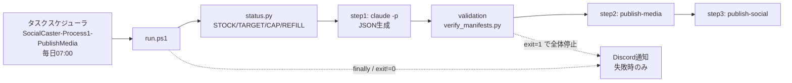

# Alignment - 共有構造と意味の対応 / Shared Structure and Semantics

このファイルは、人間とAIが作っているものの構造を同じ視点で捉え、
要望が「何の、どの側面を、どう変えたいのか」を特定するための共有地図である。

---

## 全体地図 / Project Overview

```text
SocialCaster
├─ 入力・指示 / Input            … input/inbox に置かれた画像とマニフェストJSON
├─ 自動実行 / Automation         … 毎日07:00の無人実行チェーン（run.ps1）
├─ 処理・データ / Backend        … 画像公開とSNS予約投稿、SQLiteの状態管理
├─ 外部公開 / Publishing         … NewAITees(GitHub Pages) と Buffer API
└─ 実行環境 / Infrastructure     … Windowsタスクスケジューラ、uv/.venv、.env
```

本プロジェクトに利用者向けのGUI画面は存在しない。人間の操作面はCLIとフォルダ、
そして「毎朝勝手に動いているもの」という自動実行である。

## 領域地図 / Domain Maps

### 自動実行 / Automation



```text
タスクスケジューラ（毎日07:00）
└─ run.ps1（最大10反復、在庫を毎回再計算）
   ├─ 在庫確認       status.py → REFILL<=0 なら停止
   ├─ step1 生成     claude -p で未処理画像ぶんのJSONを作る
   ├─ 検証ゲート     verify_manifests.py（inbox内の全JSONを走査）
   ├─ step2 画像公開 publish-media
   ├─ step3 予約投稿 publish-social
   └─ finally        memory.md へ記録 ＋ 失敗時のみDiscord通知
```

### 処理・データ / Backend

```text
src/social_caster/
├─ cli.py          … init-db / auth-check / publish-media / publish-social / daily-batch / add-post / run-once / run
├─ batch.py        … 日次バッチ、在庫数と補充数の算出
├─ newaitees.py    … 画像をNewAITeesへコミットしGitHub Pages反映を待つ
├─ buffer_client.py… Buffer GraphQLでInstagram/Xへ予約投稿
├─ content.py      … SNS別の本文ルール
├─ database.py     … SQLite（投稿とSNS別ステータス）
├─ scheduler.py    … 期限到来投稿の処理・常駐
├─ config.py       … .env 由来の設定
└─ provider.py
```

### 実行環境 / Infrastructure

```text
実行環境
├─ タスクスケジューラ  SocialCaster-Process1-PublishMedia
│                      Execute=powershell.exe（Windows PowerShell 5.1）
│                      LogonType=Interactive（ログオン中のみ動く）
├─ Python              .venv\Scripts\python.exe（uv管理、3.12）
└─ 秘密情報            .env（git管理外。Buffer認証とDiscord webhook）
```

## 構造と実装の対応 / Structure-to-Implementation Mapping

### 自動実行 / Automation Chain
- **役割 / Responsibility**: 人間の承認なしに、JSON生成から予約投稿までを毎日1回通す。
- **親 / Parent**: SocialCaster
- **含むもの / Contains**: 在庫確認、JSON生成、検証ゲート、画像公開、予約投稿、結果記録、失敗通知
- **画面上の位置・利用者からの見え方 / Human View**: 画面はない。Instagramの予約が増えること、Discordに失敗通知が来ないことだけが観測できる。
- **実装 / Implementation**:
  - Files: `automations/socialcaster-process-1-prepare-and-publish-media-v2/run.ps1`, `prompt.md`, `memory.md`, `logs/<yyyyMMdd_HHmmss>.log`
  - State: Windowsタスク `SocialCaster-Process1-PublishMedia`、`$automationExit`、`$stopReason`
  - API: Discord webhook（`.env` の `DISCORD_WEBHOOK_URL`）
- **指示に使える表現 / Human Labels**: 「自動起動」「自動実行」「毎朝のやつ」「プロセス1」
- **曖昧になりやすい表現 / Ambiguous Labels**: 「自動起動が止まった」… タスクの起動停止と、起動後の処理失敗の2通りに解釈できる。切り分けは下記Termsを参照。

### 検証ゲート / Manifest Validation Gate
- **役割 / Responsibility**: inbox内の全マニフェストJSONが投稿仕様を満たすか検査し、満たさなければチェーン全体を止める。
- **親 / Parent**: 自動実行 / Automation
- **含むもの / Contains**: カテゴリ、日英本文250字、ハッシュタグ20個（必須4個）、Xリンク、publish_at禁止
- **画面上の位置・利用者からの見え方 / Human View**: ログの `==== validation: verify-manifests ====` 以降の行。
- **実装 / Implementation**:
  - Files: `scripts/verify_manifests.py`
  - State: exit code（0=全件妥当、1=1件以上不正）
- **指示に使える表現 / Human Labels**: 「JSONの検証」「manifestチェック」
- **曖昧になりやすい表現 / Ambiguous Labels**: 「検証に失敗した」… 新規生成分が原因とは限らない。過去分の1件でもゲート全体が落ちる。

### 失敗通知 / Failure Notification
- **役割 / Responsibility**: 無人実行の失敗を人間へ届ける唯一の経路。
- **親 / Parent**: 自動実行 / Automation
- **実装 / Implementation**:
  - Files: `run.ps1` の `Send-DiscordNotification`（`finally` から `$automationExit -ne 0` のときのみ呼ぶ）
  - State: `.env` の `DISCORD_WEBHOOK_URL`（未設定なら通知しない）
  - API: Discord Webhook（POST、UTF-8バイト列、上限2000文字で切り詰め、TLS1.2明示）
- **指示に使える表現 / Human Labels**: 「失敗通知」「Discordに知らせる」
- **曖昧になりやすい表現 / Ambiguous Labels**: 「通知が来ない」… 正常（失敗なし）か、通知自体の故障かを区別する必要がある。ログの `==== discord notification failed: ... ====` を確認する。

### 外部公開 / Publishing
- **役割 / Responsibility**: 画像をNewAITees(GitHub Pages)で公開HTTPS URLにし、Buffer経由でSNSへ予約投稿する。
- **親 / Parent**: SocialCaster
- **含むもの / Contains**: sharpによる中間JPEG生成、NewAITeesへのcommit/push、Pages反映待ち、Buffer予約
- **画面上の位置・利用者からの見え方 / Human View**: newaitees.github.io のギャラリーと、Bufferの予約一覧。
- **実装 / Implementation**:
  - Files: `src/social_caster/newaitees.py`, `src/social_caster/buffer_client.py`, `src/social_caster/provider.py`
  - State: `posts.media_status` / `media_error`、NewAITeesのローカルコミットとリモートの進み具合
  - API: GitHub（push）、GitHub Pages（HEADで到達確認）、Buffer GraphQL
- **指示に使える表現 / Human Labels**: 「画像の公開」「Pages」「Bufferの予約」
- **曖昧になりやすい表現 / Ambiguous Labels**: 「公開した」… ローカルcommit済み・push済み・Pages反映済みの3段階がある。`media_status=SUCCESS` はPages反映まで到達した状態を指す。
- **注意 / Caveat**: NewAITeesはpushを契機にGitHub Actionsがbotコミットをpushするため、常にリモートが先に進む前提で扱う。

## 用語・概念 / Terms and Concepts

### 自動起動 / Scheduled Launch
- **意味 / Meaning**: Windowsタスクスケジューラが `run.ps1` を起動すること。処理が成功したかどうかは含まない。
- **別名 / Aliases**: 自動実行、毎朝のやつ
- **NG解釈 / Wrong Interpretation**: 「自動起動してない」＝タスクが登録されていない／トリガーが壊れている、と決めつけること。
- **OK解釈 / Correct Interpretation**: まず `Get-ScheduledTaskInfo` の `LastRunTime` と `LastTaskResult` を見る。LastRunTimeが毎日更新されていれば起動はしている。投稿が増えていないのは処理側の失敗である。

### 在庫 / Stock
- **意味 / Meaning**: Bufferに成功済みで登録されている未来の予約投稿数。
- **別名 / Aliases**: STOCK、予約の残り
- **NG解釈 / Wrong Interpretation**: inboxに残っている画像の枚数。
- **OK解釈 / Correct Interpretation**: `automation/status.py` が出す `STOCK`。`TARGET_STOCK`（9）との差が `REFILL`、`RESERVATION_CAP`（10）でクランプされる。

### マニフェスト / Manifest
- **意味 / Meaning**: `input/inbox/<画像名>.json`。1枚の画像に対する投稿本文とカテゴリの定義。
- **別名 / Aliases**: 投稿JSON、JSON
- **NG解釈 / Wrong Interpretation**: `publish_at` を書いてよい。
- **OK解釈 / Correct Interpretation**: `publish_at` は禁止（予約時刻は処理側が決める）。`image` キーはJSONのファイル名と対応必須。

---

## 意味の衝突記録 / Semantic Conflict Log

### 2026-10-07「このプロジェクトが最近自動起動してないみたいだから直してほしい」
- **対象候補 / Candidate Target**: タスクスケジューラのトリガー / run.ps1 / 検証ゲート / publish処理
- **ユーザーの意図 / User Meaning**: 結果（Instagramの予約投稿）が増えていない。
- **AIの解釈 / Agent Interpretation**: 当初「タスクが起動していない可能性」も候補に含めて調査した。
- **実装上の実体 / Actual Implementation**: タスクは毎日07:00に起動していた（LastRunTime=2026/10/07 7:00:02）。`LastTaskResult=1` で、停止点は `verify_manifests.py` の検証ゲート。原因は `random_20260220_151145_0039.png.json` の英語本文251文字。
- **現在の解釈規則 / Current Rule**: 「自動起動してない」と言われたら、(1)タスクの起動履歴、(2)直近ログの `====` 行、(3)DBに新規行が増えているか、の3点を必ず分けて確認する。起動と処理と成果を混同しない。ログの `====` が最後まで並んでいても、DBに行が増えていなければ何も投稿されていない。
- **状態 / Status**: resolved（表面の原因）／ ただし投稿停止の本当の原因は下記の多重障害だった

### 2026-10-07「自動実行は完走しているのに投稿が1件も増えない」
- **対象候補 / Candidate Target**: 検証ゲート / publish-media / NewAITeesへの公開 / Buffer予約
- **実装上の実体 / Actual Implementation**: 3段重ねだった。(1) `NewAITees/node_modules` が空で `sharp` が無く画像変換が全件失敗、(2) NewAITeesのbot自動コミットとpushが競合して2枚目以降が必ず弾かれる、(3) 失敗した入力が辞書順先頭を占めて新規に到達しない。加えてPages反映待ちの300秒が実測9分に対して短かった。
- **現在の解釈規則 / Current Rule**: `publish-media` は失敗しても exit 0 を返す。成否は exit code ではなく `media_status` と `MEDIA_FAILED` で判定する。手前の層を直すと、その下に隠れていた障害が順に露出するので、1つ直すたびに成果（DBの新規行）を確認する。
- **状態 / Status**: resolved

## 未解決の観察 / Unresolved Observations

### 2026-10-07「claudeが生成したJSONが仕様を自己申告で満たしたと報告する」
- **観察 / Observation**: step1のclaudeは「250字以内を確認済み」と報告するが、実際には251字だった。生成側の自己検証は信頼できない。
- **対象候補 / Possible Targets**: prompt.md の指示 / step1の後段に生成分だけの即時検証を挟む / 生成時に機械的に文字数を数えさせる
- **概念候補 / Possible Concepts**: 「生成の自己申告」と「機械検証」の分離
- **確信度 / Confidence**: high（事象）／ low（対策の形）
- **次に確認すること / Next Question**: 不正マニフェストを検出したとき、チェーン全体を止めるのではなく当該1件だけを隔離して残りを進める設計にすべきか。
